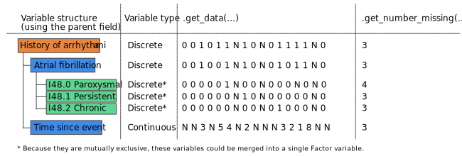

Hierarchy between variables
============================

Collections of phenotypes often exhibit a hierarchical structure. This
structure can be explicitly represented in the case report form (CRF) that was
used for data collection, or it could arise because of the clinical definition
of diseases. Structured vocabularies, like the International Classification of
Diseases, define terms of increasing specificity as one moves away from the
broader terms.

Impact on variable coding
--------------------------

In CohortManager, the hierarchy is used when encoding variables for analysis or
when computing summary statistics.

.. important::

    When data is accessed any individual marked unaffected for a parent
    variable will be set to:

        - 0 if the variable is discrete
        - NaN otherwise

The rationale behind this is that individuals that are unaffected for a parent
are unaffected for all the children. Hence, any continuous or factor variable
should not be defined for this individual. This is very practical to
represent data from case report forms that often skip questions when an
individual is unaffected for a condition.

Here is a concrete example of how variable coding works in CohortManager.
First, consider the following excerpt from a CRF:

.. code::

    1. Do you have a history of arrhythmia? (Yes/No)
       - If you answered Yes to question 1, complete the following:
            1.1 Do you have a history of atrial fibrillation? (Yes/No)
                - If you answered Yes to question 1.1, complete the following:
                    + Did you suffer from paroxysmal atrial fibrillation? (Yes/No)
                    + Did you suffer from persistent atrial fibrillation? (Yes/No)
                    + Did you suffer from chronic atrial fibrillation? (Yes/No)
            1.2 How many years ago did you suffer from atrial fibrillation?

Given the previous CRF, some medical coding implementations will represent all
the skipped fields as missing data. This is incorrect, because data is not
really missing and individuals should be recognized as controls. In
CohortManager, if the parent variable is set correctly, samples will be
dynamically reclassified to account for this.

There are a few things to note about this example:

1. The :py:meth:`cohort_manager.core.CohortManager.get_number_missing` is aware
   of the hierarchy and will understand that missing values are not truly
   missing if an individual is unaffected for a parent discrete variable.
2. When using :py:meth:`cohort_manager.core.CohortManager.add_data`, data
   for individuals unaffected for a parent will be ignored. The data **is not
   lost**, but it is dynamically remapped (to 0 or to NA) when accessed.
   Removing the parent is enough to get the initial interpretation.

Censoring
----------

It might seem intuitive to make time to event (continuous) variables children
of their associated (discrete) event variable. Because of the classification
discussed above, this will lead to errors! The time to event of censored
samples will be erroneously set to NA.

.. warning::

    Do not set the ``event`` variable as the ``time to event`` variable's
    parent.

To work around this, dummy variables can be used to organize such data. As an
example, given the ``event`` and ``time_to_event`` variables, the following
commands could be used:

.. code::

    [cohort repl]> dummy event_group
    [cohort repl]> update event
    (json)>>> {"parent": "event_group"}
    [cohort repl]> update time_to_event
    (json)>>> {"parent": "event_group"}

This will result in the following result when running the ``list`` command.

.. code::

    [cohort repl]> list
    event_group*
         - event
         - time_to_event

The star denotes that ``event_group`` does not contain information, it is a
`dummy variable` (not to be confused with the statistical term).
