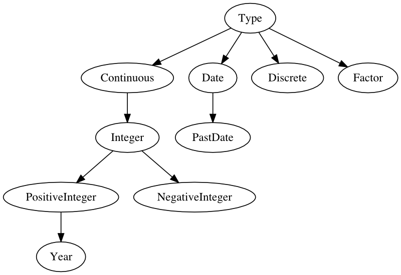

Type system
============

An important feature of this project is the unified representation of variables
across data type. This is accomplished using a hierarchical type system where
every data type defines its own validation function.

    Tree representing the relationship between data types. Most of the time,
    all the validation checks of the parent types are applied when checking a
    subtype.

The types.Type class
---------------------

.. autoclass:: cohort_manager.types.Type
    :members:
